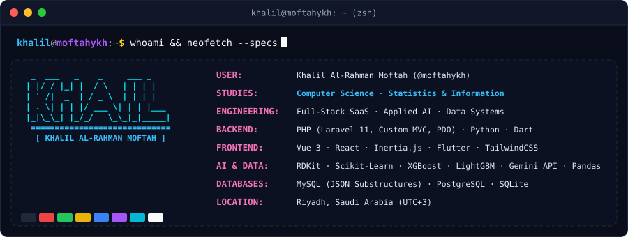

<!-- ═══════════════════════════════════════════════════════════════ -->
<!--   KHALIL AL-RAHMAN MOFTAH · TERMINAL-THEMED PROFILE README      -->
<!--   GitHub strips CSS — the terminal window is a custom SVG.      -->
<!-- ═══════════════════════════════════════════════════════════════ -->

  

  

<!-- ───────────── whoami · neofetch (custom SVG — renders on GitHub) ───────────── -->

  

<!-- ───────────── projects ───────────── -->
## `khalil@moftahykh:~/projects$ cat ENGINEERING_INDEX.md`

<table>
  <thead>
    <tr>
      <th>🗂&nbsp;PROJECT / REPOSITORY</th>
      <th>⚙️&nbsp;ARCHITECTURE &amp; KEY HIGHLIGHTS</th>
    </tr>
  </thead>
  <tbody>
    <tr><td colspan="2"><b>🧬 BIOMEDICAL ML &amp; COMPUTATIONAL BIOLOGY</b></td></tr>
    <tr>
      <td><b>🧪 <a href="https://github.com/moftahykh/MoleculeNet-HIV-Prediction">MoleculeNet-HIV-Prediction</a></b></td>
      <td>
        <b>AI-Powered Molecular Screening &amp; Anti-HIV Drug Discovery</b> 
        • Screened 41,000+ compounds from Stanford's MoleculeNet benchmark with 2,056 hybrid features (Morgan Fingerprints + Lipinski descriptors via RDKit). 
        • Handled extreme 3.5% class imbalance using SMOTE oversampling &amp; class-weighted loss, achieving <b>0.8525 ROC-AUC</b> with Random Forest / XGBoost. 
        <kbd>Python 3.10+</kbd> <kbd>RDKit</kbd> <kbd>Scikit-Learn</kbd> <kbd>XGBoost</kbd> <kbd>LightGBM</kbd> <kbd>SMOTE</kbd>
      </td>
    </tr>
    <tr>
      <td><b>🔬 <a href="https://github.com/moftahykh/cftr-pathogenicity-classifier">cftr-pathogenicity-classifier</a></b></td>
      <td>
        <b>3D Protein Structure Pathogenicity Classifier (Cystic Fibrosis)</b> 
        • Self-healing ingestion pipeline integrating AlphaFold DB v4 3D coordinates, NCBI ClinVar mutations &amp; UniProt functional annotations. 
        • Built heavy-atom residue distance matrices, GroupShuffleSplit leakage prevention &amp; interactive 3D HTML5 visualizer. 
        <kbd>Python</kbd> <kbd>AlphaFold DB</kbd> <kbd>ClinVar API</kbd> <kbd>Scikit-Learn</kbd> <kbd>Bioinformatics</kbd> <kbd>HTML5 Canvas</kbd>
      </td>
    </tr>
    <tr><td colspan="2"><b>🧠 DEEP LEARNING &amp; NEURAL NETWORKS FROM SCRATCH</b></td></tr>
    <tr>
      <td><b>🎨 <a href="https://github.com/moftahykh/mnist-nn">mnist-nn (NeuralCanvas)</a></b></td>
      <td>
        <b>From-Scratch Neural Network &amp; Real-Time In-Browser Inference</b> 
        • Implemented 2-layer neural network with pure NumPy gradient descent (784 → 128 ReLU → 10 Softmax, He init, 94% dev accuracy). 
        • Zero-dependency web app running client-side forward propagation in pure JavaScript with center-of-mass digit alignment. 
        <kbd>Python</kbd> <kbd>NumPy</kbd> <kbd>JavaScript (Vanilla)</kbd> <kbd>HTML5 Canvas</kbd> <kbd>Zero Dependencies</kbd>
      </td>
    </tr>
    <tr><td colspan="2"><b>🌐 WEB SYSTEMS, E-COMMERCE &amp; SMART CITIES</b></td></tr>
    <tr>
      <td><b>🛍️ <a href="https://github.com/moftahykh/Sadeem-Website">Sadeem-Website</a></b></td>
      <td>
        <b>سَديم (Sadeem) — Luxury Fragrance E-Commerce &amp; Systems Analysis</b> 
        • Comprehensive architectural SAD specification for Arabic-first perfume marketplace with dynamic note schemas &amp; AI recommendation quiz. 
        • Full operations model covering inventory management, accounting pipelines, and distance-based geospatial delivery logistics. 
        <kbd>System Design (SAD)</kbd> <kbd>E-Commerce</kbd> <kbd>Arabic UI/UX</kbd> <kbd>Geospatial Logistics</kbd>
      </td>
    </tr>
    <tr>
      <td><b>🚦 <a href="https://github.com/moftahykh/Smart-Trafficking-MS-Powered-by-AI">Smart-Trafficking-MS-Powered-by-AI</a></b></td>
      <td>
        <b>AI-Driven Smart Traffic Management &amp; Optimization Architecture</b> 
        • Architectural engineering blueprint for dynamic signal timing optimization, emergency vehicle prioritization &amp; congestion modeling. 
        • Comprehensive requirements specification: actor classification, CRUD matrices, sequence diagrams &amp; UML system architecture. 
        <kbd>Systems Architecture</kbd> <kbd>AI Traffic Optimization</kbd> <kbd>UML Modeling</kbd> <kbd>Smart City</kbd>
      </td>
    </tr>
    <tr>
      <td><b>🌙 <a href="https://github.com/moftahykh/zakat-web-project">zakat-web-project</a></b></td>
      <td>
        <b>Islamic Jurisprudence Zakat Calculation Web Engine</b> 
        • Web application implementing Sharia-compliant wealth &amp; asset calculation algorithms (gold/silver nisab thresholds, livestock, agricultural yields). 
        <kbd>Web Development</kbd> <kbd>PHP</kbd> <kbd>JavaScript</kbd> <kbd>CSS3</kbd>
      </td>
    </tr>
  </tbody>
</table>

## `khalil@moftahykh:~/projects$ ls --featured --live`

  
  

<!-- ───────────── skills ───────────── -->
## `khalil@moftahykh:~$ fetch-skills --display=icons --theme=dark`

  

<!-- ───────────── metrics ───────────── -->
## `khalil@moftahykh:~$ cat /proc/system/metrics`

  

  
  

  

  

<!-- ───────────── snake ───────────── -->
## `khalil@moftahykh:~$ ./stream_git_activity.sh --visualize=snake`

  <picture>
    <source media="(prefers-color-scheme: dark)" srcset="https://raw.githubusercontent.com/moftahykh/moftahykh/output/github-contribution-grid-snake-dark.svg"/>
    <source media="(prefers-color-scheme: light)" srcset="https://raw.githubusercontent.com/moftahykh/moftahykh/output/github-contribution-grid-snake.svg"/>
    
  </picture>

<!-- ───────────── contact ───────────── -->
## `khalil@moftahykh:~/contact$ ./connect.sh`

  💬 Open to collaboration, research, and interesting problems — my inbox is always open.  
  
  

  

