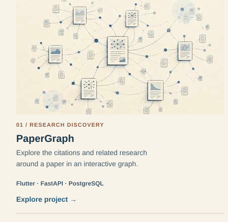
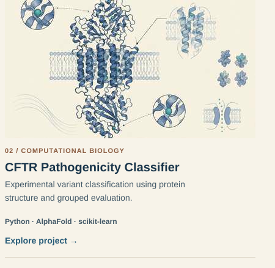
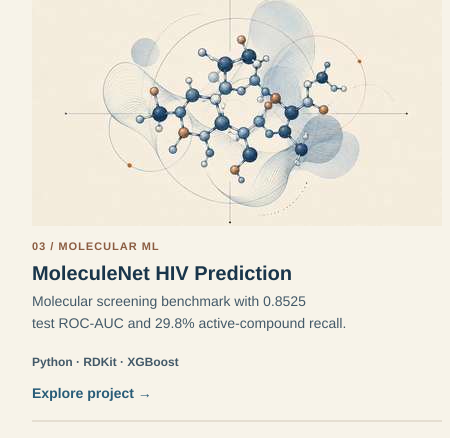
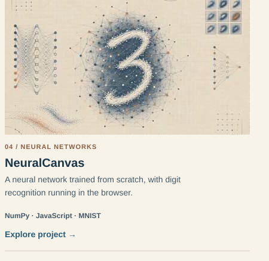

<picture><source media="(prefers-color-scheme: dark)" srcset="./assets/editorial-v2/intro-dark.svg"></picture>
<a href="https://github.com/moftahykh/papergraph"><picture><source media="(prefers-color-scheme: dark)" srcset="./assets/editorial-v2/papergraph-dark.svg"></picture></a><a href="https://github.com/moftahykh/cftr-pathogenicity-classifier"><picture><source media="(prefers-color-scheme: dark)" srcset="./assets/editorial-v2/cftr-dark.svg"></picture></a>
<a href="https://github.com/moftahykh/MoleculeNet-HIV-Prediction"><picture><source media="(prefers-color-scheme: dark)" srcset="./assets/editorial-v2/molecule-dark.svg"></picture></a><a href="https://github.com/moftahykh/mnist-nn"><picture><source media="(prefers-color-scheme: dark)" srcset="./assets/editorial-v2/neural-dark.svg"></picture></a>
<a href="mailto:khalil.moftah@gmail.com"><picture><source media="(prefers-color-scheme: dark)" srcset="./assets/editorial-v2/footer-dark.svg"></picture></a>

Profile and project details in text

**Khalil Al-Rahman Moftah** · Computer Science · Statistics & Information

I build across software and machine learning, with a particular interest in research tools, biological data, and the systems that bring them together.

- [PaperGraph](https://github.com/moftahykh/papergraph) — Explore citations and related research in an interactive graph. Flutter · FastAPI · PostgreSQL.
- [CFTR Pathogenicity Classifier](https://github.com/moftahykh/cftr-pathogenicity-classifier) — Experimental variant classification using protein structure and grouped evaluation. Python · AlphaFold · scikit-learn.
- [MoleculeNet HIV Prediction](https://github.com/moftahykh/MoleculeNet-HIV-Prediction) — Molecular screening benchmark: 0.8525 test ROC-AUC and 29.8% active-compound recall. Python · RDKit · XGBoost.
- [NeuralCanvas](https://github.com/moftahykh/mnist-nn) — A neural network trained from scratch, with digit recognition in the browser. NumPy · JavaScript · MNIST.

Project artwork is conceptual, not scientific data or application screenshots. [Email me](mailto:khalil.moftah@gmail.com).

<picture><source media="(prefers-color-scheme: dark)" srcset="https://raw.githubusercontent.com/moftahykh/moftahykh/output/github-contribution-grid-snake-dark.svg?v=2"></picture>

